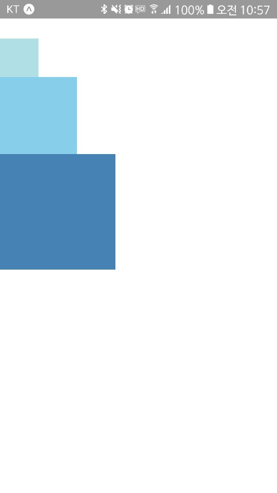
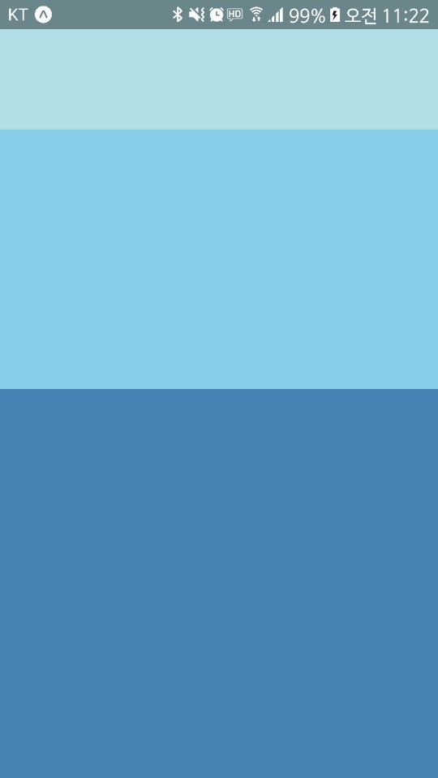
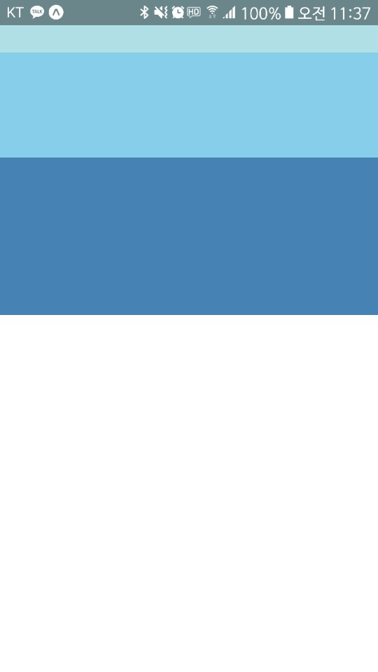

# Height and Width

구성 요소의 높이와 너비가 화면 크기를 결정

## 고정 치수

width, height 스타일 추가하여서 크기를 설정함.  
모든 치수 단위는 픽셀로 나타냄.

    import React, { Component } from 'react';
    import { AppRegistry, View } from 'react-native';

    export default class FixedDimensionsBasics extends Component {
    render() {
        return (
        <View>
            <View style={{width: 50, height: 50, backgroundColor: 'powderblue'}} />
            <View style={{width: 100, height: 100, backgroundColor: 'skyblue'}} />
            <View style={{width: 150, height: 150, backgroundColor: 'steelblue'}} />
        </View>
        );
    }
    }

    // skip this line if using Create React Native App
    AppRegistry.registerComponent('AwesomeProject', () => FixedDimensionsBasics);

이 방법으로 치수를 설정하는 것은 화면 크기에 관계없이 항상 정확히 같은 크기로 렌더링해야하는 구성 요소에 일반적.

## 플렉스 치수

동적으로 구성 요소를 확장 및 축호하게 하려면 flex를 사용하여야함. 
flex:1은 사용 가능한 모든 공간을 채우게 되고, 동일한 부모가 있는 부모가 있는 구성 요소간에 균등하게 공유하도록 사용됨. 
flex의 값이 클 수록 형제에 비해 차지하는 공간의 비율이 높아짐

상쉬 요소 치수가 고정된 width, heihgt가 없으면 하위 flex요소는 제대로 나오지 않음.

    import React, { Component } from 'react';
    import { AppRegistry, View } from 'react-native';

    export default class FlexDimensionsBasics extends Component {
    render() {
        return (
            // Try removing the `flex: 1` on the parent View.
            // The parent will not have dimensions, so the children can't expand.
            // What if you add `height: 300` instead of `flex: 1`?
            <View style={{flex: 1}}>
            <View style={{flex: 1, backgroundColor: 'powderblue'}} />
            <View style={{flex: 2, backgroundColor: 'skyblue'}} />
            <View style={{flex: 3, backgroundColor: 'steelblue'}} />
            </View>
        );
        }
    }

    // skip this line if using Create React Native App
    AppRegistry.registerComponent('AwesomeProject', () => FlexDimensionsBasics);

Try removing the `flex: 1` on the parent View. 
he parent will not have dimensions, so the children can't expand.

부모에게 flex:1를 제거하면 화면 자체가 나오지 않는다.

What if you add `height: 300` instead of `flex: 1`?

flex:1 대신 height:300을 넣으면 아래와 같이 나오게 됩니다.

300px를 기준으로 1:2:3의 비율로 화면에 나타나는 것을 보실 수 있습니다.