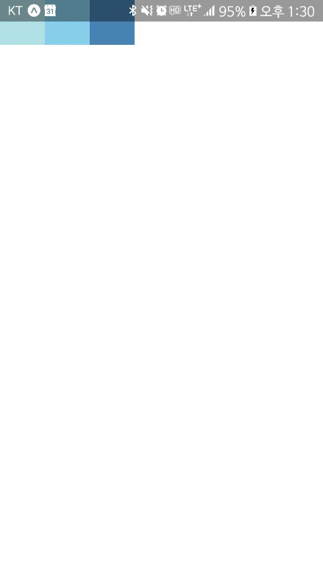
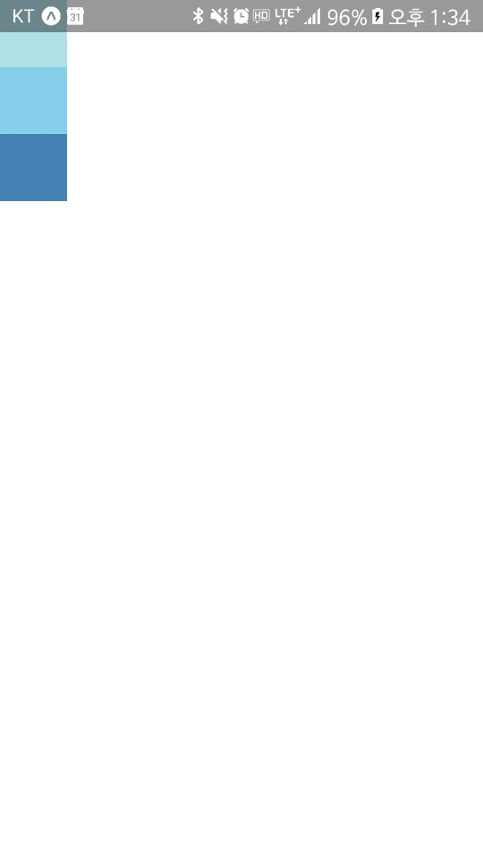
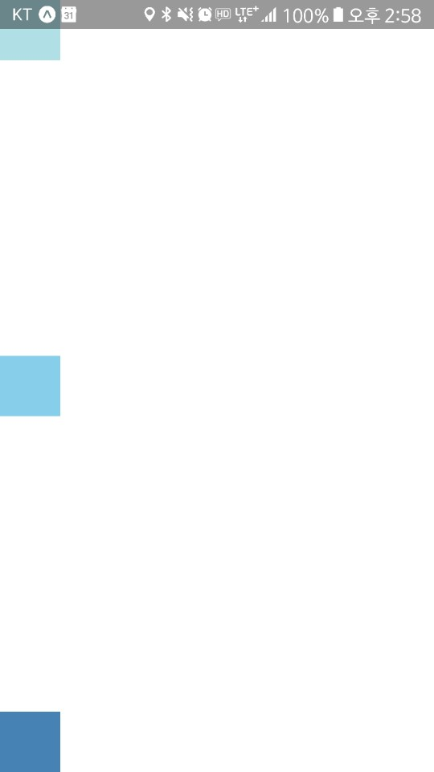
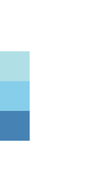
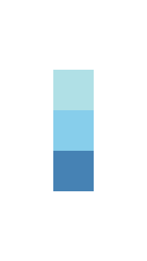

# Layout with Flexbox

보통 flexDirection, alignItems, justifyContent의 조합을 사용합니다.

## Flex Direction

flexDirection은 기본축을 결정합니다.
기본값은 colum(수직)이며 row(수평)으로도 설정가능합니다.

    import React, { Component } from 'react';
    import { AppRegistry, View } from 'react-native';

    export default class FlexDirectionBasics extends Component {
    render() {
        return (
        // Try setting `flexDirection` to `column`.
        <View style={{flex: 1, flexDirection: 'row'}}>
            <View style={{width: 50, height: 50, backgroundColor: 'powderblue'}} />
            <View style={{width: 50, height: 50, backgroundColor: 'skyblue'}} />
            <View style={{width: 50, height: 50, backgroundColor: 'steelblue'}} />
        </View>
        );
    }
    };

    // skip this line if using Create React Native App
    AppRegistry.registerComponent('AwesomeProject', () => FlexDirectionBasics);

Try setting `flexDirection` to `column`

flexDirection을 column으로 설정하면 아래와 같이 나오게 됩니다.

# Justify Content

justifyContent를 사용하여 주 축에 따른 자식의 분포가 결정되게 됩니다.

사용할 수 있는 옵션은 flex-start, center, flex-end, space-around, space-between, space-evenly 입니다.

    import React, { Component } from 'react';
    import { AppRegistry, View } from 'react-native';

    export default class JustifyContentBasics extends Component {
    render() {
        return (
        // Try setting `justifyContent` to `center`.
        // Try setting `flexDirection` to `row`.
        <View style={{
            flex: 1,
            flexDirection: 'column',
            justifyContent: 'space-between',
        }}>
            <View style={{width: 50, height: 50, backgroundColor: 'powderblue'}} />
            <View style={{width: 50, height: 50, backgroundColor: 'skyblue'}} />
            <View style={{width: 50, height: 50, backgroundColor: 'steelblue'}} />
        </View>
        );
    }
    };

    // skip this line if using Create React Native App
    AppRegistry.registerComponent('AwesomeProject', () => JustifyContentBasics);

// Try setting `justifyContent` to `center`.

justifyContent를 center로 설정하면 아래와 같이 변하게 됩니다.

// Try setting `flexDirection` to `row`.

flexDirection을 row로 설정하면 아래와 같이 나오게 됩니다.

## Align Items

Align Items은 보조 축을 따라 자식 정렬을 결정합니다. 
사용할 수 있는 옵션으로는 flex-start, center, flex-end, stretch 가 있습니다.

    import React, { Component } from 'react';
    import { AppRegistry, View } from 'react-native';

    export default class AlignItemsBasics extends Component {
    render() {
        return (
        // Try setting `alignItems` to 'flex-start'
        // Try setting `justifyContent` to `flex-end`.
        // Try setting `flexDirection` to `row`.
        <View style={{
            flex: 1,
            flexDirection: 'column',
            justifyContent: 'center',
            alignItems: 'center',
        }}>
            <View style={{width: 50, height: 50, backgroundColor: 'powderblue'}} />
            <View style={{width: 50, height: 50, backgroundColor: 'skyblue'}} />
            <View style={{width: 50, height: 50, backgroundColor: 'steelblue'}} />
        </View>
        );
    }
    };

    // skip this line if using Create React Native App
    AppRegistry.registerComponent('AwesomeProject', () => AlignItemsBasics);

// Try setting `alignItems` to 'flex-start'

alignItems를 flex-start로 바꿔주면 아래와 같습니다.

// Try setting `justifyContent` to `flex-end`.

justifyContent를 flex-end로 바꿔주면 아래와 같습니다.

// Try setting `flexDirection` to `row`.

flexDirection를 row로 바꿔주면 아래와 같습니다.

Layout Props : https://facebook.github.io/react-native/docs/layout-props.html