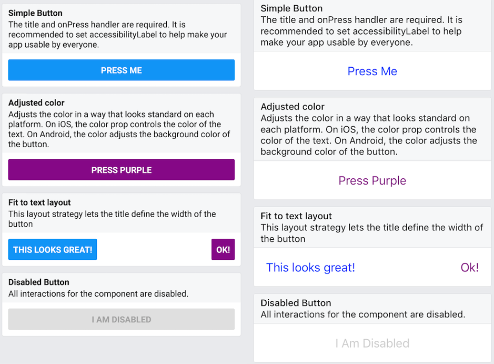

button에 대한 것을 최소한으로 표현하자면 아래와 같습니다.

    <Button
        onPress={() => {
            Alert.alert('You tapped the button!');
        }}
        title="Press Me"
    />

버튼은 모든 플랫폼에서 렌더링되는 기본 버튼 구성 요소를 제공

https://facebook.github.io/react-native/docs/button.html

 iOS에서는 파란색 라벨이 표시되고 Android에서는 흰색 텍스트가있는 파란색 둥근 사각형이 렌더링.  버튼을 누르면 "onPress"기능이 호출되며이 경우 경고 팝업이 표시. 

    import React, { Component } from 'react';
    import { Alert, AppRegistry, Button, StyleSheet, View } from 'react-native';

    export default class ButtonBasics extends Component {
    _onPressButton() {
        Alert.alert('You tapped the button!')
    }

    render() {
        return (
        <View style={styles.container}>
            <View style={styles.buttonContainer}>
            <Button
                onPress={this._onPressButton}
                title="Press Me"
            />
            </View>
            <View style={styles.buttonContainer}>
            <Button
                onPress={this._onPressButton}
                title="Press Me"
                color="#841584"
            />
            </View>
            <View style={styles.alternativeLayoutButtonContainer}>
            <Button
                onPress={this._onPressButton}
                title="This looks great!"
            />
            <Button
                onPress={this._onPressButton}
                title="OK!"
                color="#841584"
            />
            </View>
        </View>
        );
    }
    }

    const styles = StyleSheet.create({
    container: {
    flex: 1,
    justifyContent: 'center',
    },
    buttonContainer: {
        margin: 20
    },
    alternativeLayoutButtonContainer: {
        margin: 20,
        flexDirection: 'row',
        justifyContent: 'space-between'
    }
    })

    // skip this line if using Create React Native App
    AppRegistry.registerComponent('AwesomeProject', () => ButtonBasics);